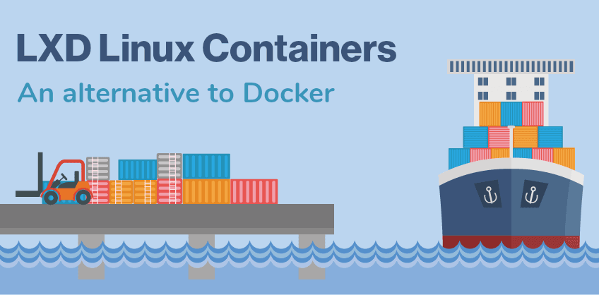

# Anteproyecto de investigación y uso de LXD
Anteproyecto de fin de grado ASIR2.

Título: Investigación y uso de LXD

Autor: Óscar Álvarez Lucas

## Introducción del proyecto.

Últimamente he estado buscando ideas para hacer el proyecto de fin de grado, buscando referencias con otros trabajos consultando ideas con los profesores... etc

Después de bastante tiempo de buscar y teniendo en cuenta mis capacidades he encontrado una herramienta muy útil en la que me gustaría indagar, quería buscar una forma alternativa a la virtualización que estamos acostumbrados con un hipervisor de tipo 2, en un principio pensé en aprender docker, ya que es la herramienta de contenedores más conocida dentro del sector, pero vi una opción gratuita muy buena con muy buena estabilidad y sin tantos errores como otros que encontré, véase docker del cual investigué y se me hacía muy difícil la comprensión del software y la configuración.

Así que mi decisión final fue LXD que es un software de creación de contenedores de linux, que al contrario que docker puede contener más que una aplicación, un sistema operativo entero.

Mi trabajo va a consistir de una investigación exhaustiva de LXD y como aplicar sus funcionalidades a algo más personalizado y real para un entorno de trabajo, explicar ventajas y desventajas de usar este software ya que no todo lo que reluce es oro e intentar una mini clúster de contenedores con diferentes funcionalidades.

A priori no parece un proyecto muy complicado, pero es un proyecto en el que voy a aprender mucho y lo más importante es que no necesito de muchos recursos que no tengo para realizarlo ya que estuve mirando otras ideas y hacer cosas de caracter material cuesta dinero. 

## Finalidad del proyecto

Ya que es un software que nos permite hacer muchas cosas, la finalidad de este proyecto puede servir como una guía para la gente novata que quiera aprender a hacer diferentes estructuras con contenedores pero que no tengan los conocimientos de como hacerlo, a su vez llevado al ámbito práctico, puede servir para montar nuestra propia estructura de servidores conectados entre sí.

## Objetivos

Una vez puesto en marcha el proyecto vamos a ser capaces de crear nuestra propia organización de contenedores gestionados en una red creada por nosotros mismos que hace de puente entre tus clusters por lo cual tendrán conectividad entre sí, dando lugar a la posibilidad de crear una estructura como nosotros queramos, para final de proyecto aparte de toda la información documentada de como se usa el software crearemos nuestra propia estructura personalizada.

## Medios y hardware y software a utilizar

- Un ordenador con VmWare Instalado
- Una máquina virtual con cualquier distribución de Linux instalada (Creo que voy a utilizar Debian)
- LXD
- LXC
- Software de almacenamiento Btrfs
- Cliente Spice "virt-viewer"

## Planificación
Al ser un proyecto más de buscar información y plasmarla a una investigación y luego montar algo práctico no se exactamente el tiempo que tardaré así que esto es algo aproximado:

- Encontrar la distribución de Linux en la cual voy a basar el proyecto (2/3 horas)
- Buscar información sobre LXD/LXC y comprobar que es verídica (20+ horas)
- Elaborar un entorno con contenedores y máquinas virtuales haciendo uso de LXC/LXD y configuración de los servicios (10+ horas)
- Documentar la información y hacer una presentación (5+ horas)
- Resolución de errores o añadidos inesperados al proyecto (4/8 horas)
